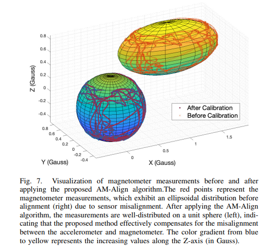
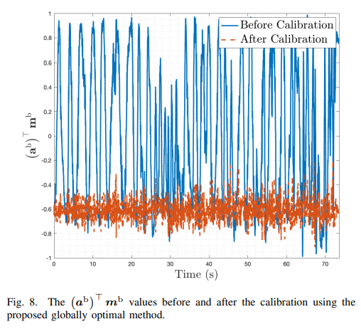

# AM_Align
AM-Align: Globally Optimal Estimation of Accelerometer-Magnetometer Misalignment





# AM-Align: Accelerometer-Magnetometer Alignment for LIO Initialization

[](https://opensource.org/licenses/MIT)
[](https://github.com/yourusername/AM-Align/stargazers)
[](https://github.com/yourusername/AM-Align/issues)

AM-Align is a globally optimal method for solving the accelerometer-magnetometer alignment problem, specifically designed to be easily integrated into the initialization process of LiDAR-Inertial Odometry (LIO) systems. The package provides a complete set of algorithms, including intrinsic calibration, making it a convenient solution for improving the accuracy and robustness of LIO.

## Features

- Globally optimal solution for accelerometer-magnetometer alignment
- Robust to insufficient and outlier-corrupted data
- Requires only four pairs of measurements for complete calibration
- Efficient and accurate computation using the polynomial eigenvalue technique
- Intrinsic calibration algorithms for accelerometer and magnetometer
- Seamless integration into LIO initialization process
- Validated through extensive simulations and real-world experiments

## Prerequisites

- C++11 or newer
- CMake 3.10 or newer
- Eigen3

## Installation

1. Clone the repository:

```bash
git clone https://github.com/yourusername/AM-Align.git
```

2. Build the project:

```bash
cd AM-Align
mkdir build && cd build
cmake ..
make
```

## Usage

1. Prepare your accelerometer and magnetometer data in the required format.

2. Run the intrinsic calibration:

```bash
./am_align_calibration --acc_data /path/to/acc_data --mag_data /path/to/mag_data
```

3. Run the AM-Align alignment estimation:

```bash
./am_align --acc_data /path/to/calibrated_acc_data --mag_data /path/to/calibrated_mag_data
```

4. Integrate the estimated alignment into your LIO initialization process.

For more detailed usage instructions and examples, please refer to the [documentation](docs/README.md).

## Contributing

We welcome contributions to AM-Align! If you have any ideas, suggestions, or bug reports, please open an issue or submit a pull request. For major changes, please discuss them with the authors first.

Before contributing, please read our [contributing guidelines](CONTRIBUTING.md) and [code of conduct](CODE_OF_CONDUCT.md).

## License

AM-Align is released under the [MIT License](LICENSE).

## Citation

If you use AM-Align in your research, please cite our paper:

```bibtex
@article{yourlastname2023amalign,
  title={AM-Align: Globally Optimal Accelerometer-Magnetometer Alignment for LIO Initialization},
  author={Your Name and Co-authors},
  journal={Your Journal Name},
  year={2023},
  publisher={Your Publisher}
}
```

## Acknowledgments

We would like to thank the following individuals and organizations for their contributions and support:

- [Contributor 1](https://github.com/contributor1)
- [Contributor 2](https://github.com/contributor2)
- [Organization 1](https://organization1.com)

## Contact

For questions, comments, or suggestions, please contact:

Your Name
Your Affiliation
Your Email Address

Project Link: [https://github.com/yourusername/AM-Align](https://github.com/yourusername/AM-Align)
