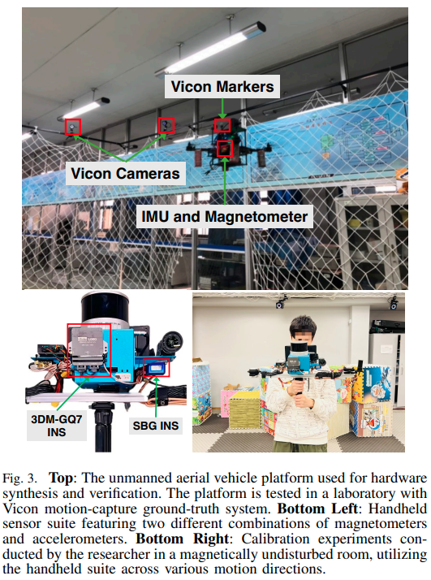
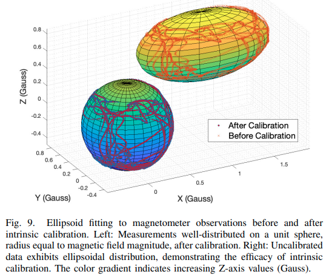
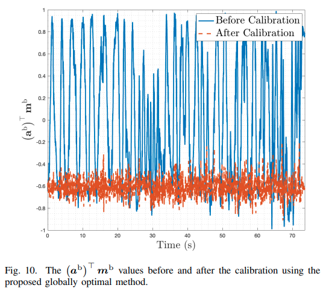
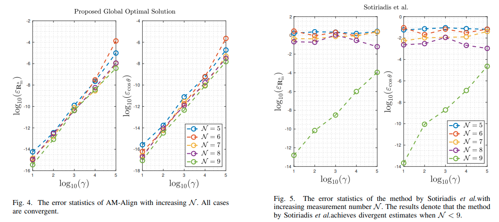

# AM-Align: Globally Optimal Estimation of Accelerometer-Magnetometer Misalignment

[](https://opensource.org/licenses/MIT)
[](https://github.com/JokerJohn/AM_Align/stargazers)
[](https://github.com/JokerJohn/AM_Align/issues)

AM-Align is a globally optimal method for solving the accelerometer-magnetometer(AM) alignment problem. The package provides a complete set of algorithms, including intrinsic calibration, making it a convenient solution for improving the accuracy and robustness of inertial navigation systems.




| Intrinsic calibration                                        | AM-Align                                                     |
| ------------------------------------------------------------ | ------------------------------------------------------------ |
|  |  |

<div align="center">


</div>

## Features

- Globally optimal solution for accelerometer-magnetometer alignment
- Robust to insufficient and outlier-corrupted data
- Requires only four pairs of measurements for complete calibration
- Efficient and accurate computation using the polynomial eigenvalue technique

## Prerequisites

- C++11 or newer
- CMake 3.10 or newer
- Eigen3

## Installation

1. Clone the repository:

```bash
git clone https://github.com/JokerJohn/AM_Align
```

2. Build the project:

```bash
cd AM-Align
mkdir build && cd build
cmake ..
make
```

## Usage

1. Prepare your accelerometer and magnetometer data in the required format.

2. Run the intrinsic calibration:

```bash
./am_align_calibration --acc_data /path/to/acc_data --mag_data /path/to/mag_data
```

3. Run the AM-Align alignment estimation:

```bash
./am_align --acc_data /path/to/calibrated_acc_data --mag_data /path/to/calibrated_mag_data
```

4. Integrate the estimated alignment into your LIO initialization process.

For more detailed usage instructions and examples, please refer to the [documentation](docs/README.md).

## Contributing

We welcome contributions to AM-Align! If you have any ideas, suggestions, or bug reports, please open an issue or submit a pull request. For major changes, please discuss them with the authors first.

Before contributing, please read our [contributing guidelines](CONTRIBUTING.md) and [code of conduct](CODE_OF_CONDUCT.md).

## License

AM-Align is released under the [MIT License](LICENSE).

## Citation

If you use AM-Align in your research, please cite our paper:

```bibtex
@article{xhu2024amalign,
  title={AM-Align: Globally Optimal Accelerometer-Magnetometer Alignment for LIO Initialization},
  author={X. Hu, J. Wu, B. Xue, Y. Zhu, M. Jia,Y. Jiang, Y. Qi, P. Tan, W. Zhang},
  journal={arxiv},
  year={2024},
  publisher={arxiv}
}
```

## Acknowledgments

We would like to thank the following authors for their contributions and support:

- [Jin Wu](https://github.com/zarathustr)

## Contact

For questions, comments, or suggestions, please contact xhubd@connect.ust.hk.
